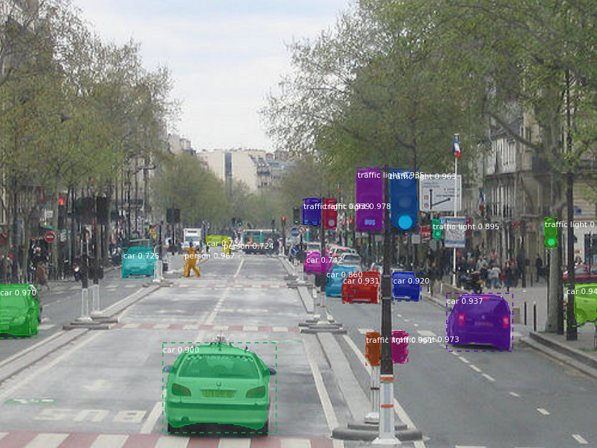

## Mask R-CNN 训练自己的数据集

## Mask R-CNN for Object Detection and Segmentation

**徐静**


paper: [Mask R-CNN](https://arxiv.org/abs/1703.06870)

Mask R-CNN的Python3, Keras和TensorFlow实现，该网络基于Feature Pyramid Network(FPN)和ResNet101 backbone


该Repository实现了:

* 基于FPN和ResNet101的Mask R-CNN网络.
* 训练基于COCO标注数据样式的标注
* 预训练模型
* Jupyter notebooks 可是化整个训练和推断过程
* 多GPU并行训练
* 评价指标AP
* 训练自己数据及的样例


相关文件说明：

* [demo.ipynb](samples/demo.ipynb) 用预训练的MS COCO数据集分割自己数据的demo
* [train_shapes.ipynb](samples/shapes/train_shapes.ipynb) 如何使用MS R-CNN训练自己的数据集，以toy data Shapes为例
* ([model.py](mrcnn/model.py), [utils.py](mrcnn/utils.py), [config.py](mrcnn/config.py)): Mask R-CNN的实现
* [inspect_data.ipynb](samples/coco/inspect_data.ipynb). 数据预处理每一步的可视化
* [inspect_model.ipynb](samples/coco/inspect_model.ipynb) 模型训练过程的可视化
* [inspect_weights.ipynb](samples/coco/inspect_weights.ipynb) 训练好的模型的可视化

### 1.数据准备

使用labelme做标注，标注后转化为COCO样式的数据，该过程请参考labelme教程，在此不赘述，标注的训练数据为专业的医学消化内镜数据，因涉及数据安全和隐私的保护，不会提供和公开该标注数据集。


### 2.重写config和dataset两个类，并构造训练过程

详细参考`./samples/water/coco.py`

+ 重写config文件

```
class CocoConfig(Config):
    """Configuration for training on MS COCO.
    Derives from the base Config class and overrides values specific
    to the COCO dataset.
    """
    # Give the configuration a recognizable name
    NAME = "coco"

    # We use a GPU with 12GB memory, which can fit two images.
    # Adjust down if you use a smaller GPU.
    # IMAGES_PER_GPU = 8
    IMAGES_PER_GPU = 2


    # Uncomment to train on 8 GPUs (default is 1)
    GPU_COUNT = 1

    # Number of classes (including background)
    NUM_CLASSES = 1 + 2  # COCO has 80 classes

    # Backbone network architecture
    # Supported values are: resnet50, resnet101
    BACKBONE = "resnet50"

    # Input image resizing
    # Random crops of size 512x512
    IMAGE_RESIZE_MODE = "crop"
    IMAGE_MIN_DIM = 512
    IMAGE_MAX_DIM = 512
    IMAGE_MIN_SCALE = 2.0

    # Length of square anchor side in pixels
    RPN_ANCHOR_SCALES = (8, 16, 32, 64, 128)

```

关于config的介绍请参考`./mrcnn/config.py`

+ 重写dataset

```
class CocoDataset(utils.Dataset):
    def load_coco(self, dataset_dir, subset,class_ids=None,class_map=None, return_coco=False):
        """Load a subset of the COCO dataset.
        dataset_dir: The root directory of the COCO dataset.
        subset: What to load (train, val)
        class_ids: If provided, only loads images that have the given classes.
        class_map: TODO: Not implemented yet. Supports maping classes from
            different datasets to the same class ID.
        return_coco: If True, returns the COCO object.
     
        """

        # 将自己的标注和图像文件的路径修改成自己的
        # coco = COCO("{}/annotations/instances_{}{}.json".format(dataset_dir, subset, year))
        coco = COCO("{}/annotations/annotations_{}.json".format(dataset_dir, subset))
        # image_dir = "{}/{}".format(dataset_dir, subset)
        image_dir = "{}/images".format(dataset_dir)


        # Load all classes or a subset?
        # 注意将标注文件中__background__类别去掉
        if not class_ids:
            # All classes
            class_ids = sorted(coco.getCatIds())

        # All images or a subset?
        if class_ids:
            image_ids = []
            for id_ in class_ids:
                image_ids.extend(list(coco.getImgIds(catIds=[id_])))
            # Remove duplicates
            image_ids = list(set(image_ids))
        else:
            # All images
            image_ids = list(coco.imgs.keys())

        # Add classes
        for i in class_ids:
            self.add_class("coco", i, coco.loadCats(i)[0]["name"])

        # Add images
        for i in image_ids:
            self.add_image(
                "coco", image_id=i,
                path=os.path.join(image_dir, coco.imgs[i]['file_name']),
                width=coco.imgs[i]["width"],
                height=coco.imgs[i]["height"],
                annotations=coco.loadAnns(coco.getAnnIds(
                    imgIds=[i], catIds=class_ids, iscrowd=None)))
        if return_coco:
            return coco

   
    def load_mask(self, image_id):
        """Load instance masks for the given image.

        Different datasets use different ways to store masks. This
        function converts the different mask format to one format
        in the form of a bitmap [height, width, instances].

        Returns:
        masks: A bool array of shape [height, width, instance count] with
            one mask per instance.
        class_ids: a 1D array of class IDs of the instance masks.
        """
        # If not a COCO image, delegate to parent class.
        image_info = self.image_info[image_id]
        if image_info["source"] != "coco":
            return super(CocoDataset, self).load_mask(image_id)

        instance_masks = []
        class_ids = []
        annotations = self.image_info[image_id]["annotations"]
        # Build mask of shape [height, width, instance_count] and list
        # of class IDs that correspond to each channel of the mask.
        for annotation in annotations:
            class_id = self.map_source_class_id(
                "coco.{}".format(annotation['category_id']))
            if class_id:
                m = self.annToMask(annotation, image_info["height"],
                                   image_info["width"])
                # Some objects are so small that they're less than 1 pixel area
                # and end up rounded out. Skip those objects.
                if m.max() < 1:
                    continue
                # Is it a crowd? If so, use a negative class ID.
                if annotation['iscrowd']:
                    # Use negative class ID for crowds
                    class_id *= -1
                    # For crowd masks, annToMask() sometimes returns a mask
                    # smaller than the given dimensions. If so, resize it.
                    if m.shape[0] != image_info["height"] or m.shape[1] != image_info["width"]:
                        m = np.ones([image_info["height"], image_info["width"]], dtype=bool)
                instance_masks.append(m)
                class_ids.append(class_id)

        # Pack instance masks into an array
        if class_ids:
            mask = np.stack(instance_masks, axis=2).astype(np.bool)
            class_ids = np.array(class_ids, dtype=np.int32)
            return mask, class_ids
        else:
            # Call super class to return an empty mask
            return super(CocoDataset, self).load_mask(image_id)

    # def image_reference(self, image_id):
    #     """Return a link to the image in the COCO Website."""
    #     info = self.image_info[image_id]
    #     if info["source"] == "coco":
    #         return "http://cocodataset.org/#explore?id={}".format(info["id"])
    #     else:
    #         super(CocoDataset, self).image_reference(image_id)

    # The following two functions are from pycocotools with a few changes.

    def annToRLE(self, ann, height, width):
        """
        Convert annotation which can be polygons, uncompressed RLE to RLE.
        :return: binary mask (numpy 2D array)
        """
        segm = ann['segmentation']
        if isinstance(segm, list):
            # polygon -- a single object might consist of multiple parts
            # we merge all parts into one mask rle code
            rles = maskUtils.frPyObjects(segm, height, width)
            rle = maskUtils.merge(rles)
        elif isinstance(segm['counts'], list):
            # uncompressed RLE
            rle = maskUtils.frPyObjects(segm, height, width)
        else:
            # rle
            rle = ann['segmentation']
        return rle

    def annToMask(self, ann, height, width):
        """
        Convert annotation which can be polygons, uncompressed RLE, or RLE to binary mask.
        :return: binary mask (numpy 2D array)
        """
        rle = self.annToRLE(ann, height, width)
        m = maskUtils.decode(rle)
        return m

```


### 3.实现OpenCV读取图片推断单张图像

请参考`./samples/water/detection.py`,因原Mask R-CNN使用skimage和matplotlib处理数据，我们实现了通过OpenCV处理数据，并将最终的识别结果通过OpenCV保存和抛出。


### 4.实现OpenCV读取视频推断视频

请参考`./samples/water/detection_video.py`,原Mask R-CNN中并未提供视频推断的源码，我们基于OpenCV实现了训练Mask R-CNN模型的视频推断过程，并计算推断的帧率（FPS)

### 5.demo

训练模型

```
# 基于pre-trained COCO weights训练新的模型
python3 coco.py train --dataset=./myData/coco/ --model=coco

#基于预训练的 ImageNet weights，训练新的模型
python3 coco.py train --dataset=./myData/coco/ --model=imagenet 

# 断点训练1
python3 coco.py train --dataset=/path/to/coco/ --model=/path/to/weights.h5

# 断点训练2
python3 coco.py train --dataset=/path/to/coco/ --model=last

```

模型推断

```
# 图像
python3 detection.py

# 视频
python3 detection_video.py

```




### Citation

```
@misc{matterport_maskrcnn_2017,
  title={Mask R-CNN for object detection and instance segmentation on Keras and TensorFlow},
  author={Waleed Abdulla},
  year={2017},
  publisher={Github},
  journal={GitHub repository},
  howpublished={\url{https://github.com/matterport/Mask_RCNN}},
}
```